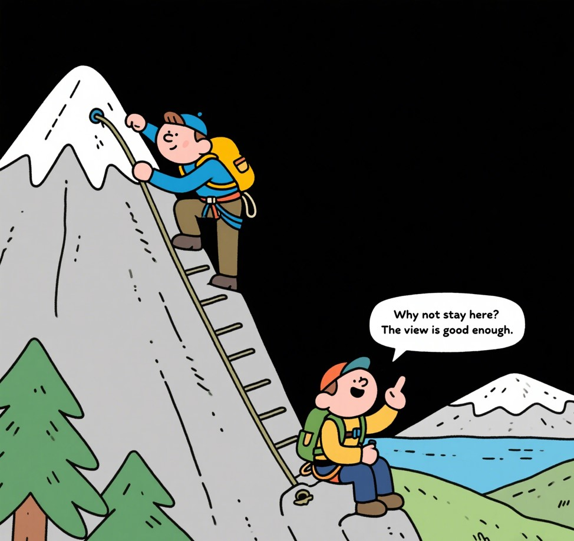

# **Part A 小作文（10分）**

**Directions:**
Suppose your university is organizing an online lecture on "Artificial Intelligence and Future Careers". Write an email to invite Professor Smith from the University of Cambridge to deliver the lecture. Your email should include:

1. Purpose of the invitation;

2. Time and format of the event;

3. Possible topics to be covered.

Write your answer in about 100 words.

> 假设您的大学正在组织有关“人工智能和未来职业”的在线演讲。写一封电子邮件，邀请剑桥大学的史密斯教授进行讲座。您的电子邮件应包括：
>
> 1. 邀请的目的；
> 2. 活动的时间和格式；
> 3. 可能涵盖的主题。

# **Part B 大作文（20分）**

**Directions:**
Write an essay based on the following cartoon. In your essay, you should:

1. Describe the cartoon briefly;

2. Interpret its intended meaning;

3. Give your comments.

Write your answer in 160-200 words.

> 根据以下卡通撰写一篇文章。在您的文章中，您应该：
>
> 1. 简要描述卡通；
> 2. 解释其预期的含义；
> 3. 请发表您的评论。
>
> 卡通描述：两名登山者在山上。一个人在努力达到顶峰，而另一个则坐在中途，说：“为什么不呆在这里？景色足够好。”

# Part A 范文

**Subject: Invitation to Deliver a Lecture on AI and Future Careers**

> 主题：邀请您就“人工智能与未来职业”发表演讲

Dear Professor Smith,

I am writing on behalf of Tsinghua University to extend a sincere invitation for you to deliver an online lecture on "Artificial Intelligence and Future Careers" scheduled for June 15, 2025, at 3:00 PM (Beijing Time). This event is designed to equip students with insights into the transformative impact of AI on global job markets and the essential skills needed for future career success.

> 我谨代表清华大学诚挚邀请您于2025年6月15日下午3点（北京时间）就“人工智能与未来职业”发表线上演讲。本次活动旨在帮助学生深入了解人工智能对全球就业市场的变革性影响，以及未来职业成功所需的关键技能。

Given your esteemed position as a leading expert in AI ethics, we believe your perspectives on critical topics such as "AI-Driven Innovation in Education" and "Ethical Challenges in Emerging Technologies" would be of immense value to our students. The lecture will be conducted on Zoom, followed by a live Q&A session to engage with our audience.

> 鉴于您在人工智能伦理领域的卓越地位，我们相信您对“教育领域的AI驱动创新”及“新兴技术中的伦理挑战”等关键议题的见解将为学生带来巨大价值。讲座将通过Zoom平台进行，结束后设有实时问答环节，以便与观众互动。

We would be deeply honored by your participation. Kindly confirm your availability at your earliest convenience so we can make the necessary arrangements.

> 若您能拨冗参与，我们将深感荣幸。恳请您尽早确认是否可行，以便我们做好相应安排。

Yours sincerely,

Li Ming

# Part B 范文

**Title: The Pursuit of Excellence: Beyond Comfort Zones**

> 标题：追求卓越：超越舒适区

The cartoon portrays two climbers on a mountain. One, with a determined look and a backpack, is straining every muscle to ascend the steep slope. The other, sitting leisurely on a rock halfway up and sipping from a thermos, says to his companion, “Why not stay here? The view is good enough.” The climbers' contrasting postures and attitudes vividly highlight the age-old dilemma between complacency and the pursuit of excellence.

> 漫画描绘了山上的两名攀登者。一人神情坚毅，背着背包，正竭尽全力攀爬陡坡；另一人则半山腰悠闲地坐在岩石上，喝着保温杯里的水，对同伴说道：“为什么不留在这儿？风景已经够好了。” 两人截然不同的姿态与态度，生动凸显了安于现状与追求卓越这一亘古不变的人生抉择。

This cartoon carries a profound message: true success demands stepping out of one's comfort zone and relentlessly striving for higher goals. The climber pushing forward symbolizes those who embrace challenges and pursue self-transcendence. History offers ample examples of such individuals. Take Thomas Edison, for instance. After countless failures in his quest to invent the electric light bulb, he could have rested on his laurels with his previous achievements. Yet, driven by an insatiable curiosity and an unwavering belief in progress, he persevered, eventually illuminating the world in a way that few could have imagined at the time.

> 这幅漫画传递了一个深刻的启示：真正的成功需要走出舒适区，不懈追求更高目标。奋力前行的攀登者象征着那些勇于迎接挑战、追求自我超越的人。历史上此类人物比比皆是。以托马斯·爱迪生为例，在发明电灯的无数次失败后，他本可以躺在过往成就上安于现状。然而，在永不满足的好奇心和对进步的坚定信念驱动下，他坚持探索，最终以当时世人难以想象的方式照亮了世界。

In our rapidly evolving world, this philosophy is more crucial than ever. While temporary contentment may offer fleeting comfort, it is the courage to pursue excellence that fuels societal advancement. Universities and workplaces should foster an environment that rewards innovation and resilience. They could establish innovation labs where students and employees can freely experiment with new ideas. Additionally, implementing a recognition system that highlights and rewards those who consistently push boundaries would serve as a powerful incentive. Let us channel the spirit of the climber pressing on, for it is in the ascent that we truly measure the heights of human potential.

> 在快速变迁的当代社会，这一哲理比以往任何时候都更重要。暂时的满足或许能带来片刻安逸，但正是追求卓越的勇气推动着社会进步。高校与职场应营造奖励创新与韧性的环境：学校可设立创新实验室，供学生和员工自由试验新想法；企业则可建立表彰制度，重点奖励那些不断突破边界的人。让我们发扬那位奋力攀登者的精神，因为唯有在向上攀登的过程中，我们才能真正丈量人类潜能的巅峰。